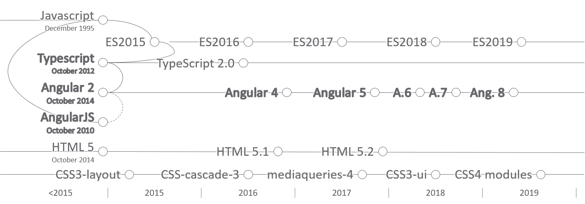
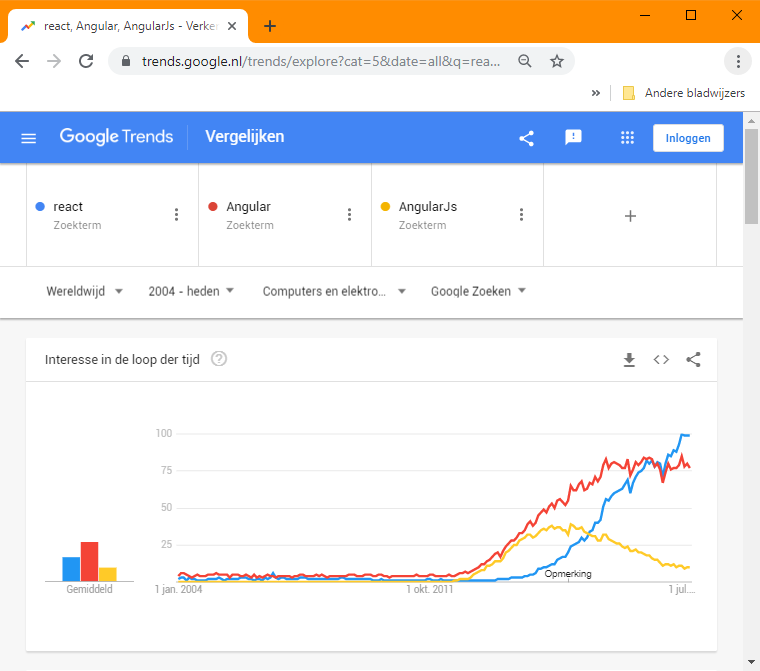
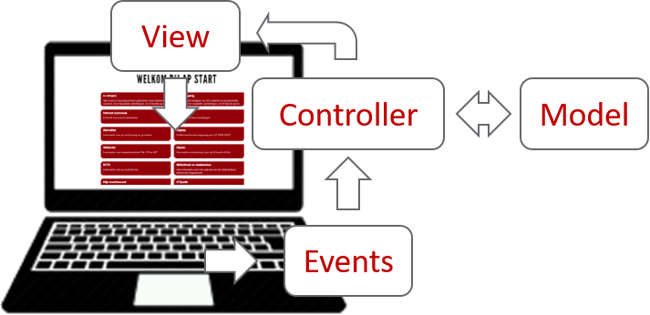

# Web Frameworks Deel I (26543/1700/1920/1/00)

## Angular Basics (By example)


## Quick Facts

Angular is

- an open-source TypeScript library to build web apps with
- developed by the *Angular Team* of Google
- meant to adopt an MVC architecture

## History





### MVC




- Keep view separate from user event handling (controller) and from data model
- Work around a central data model
- Work more OO
- Validate several internal (web forms) and external (APIs) data sources and coupled it to the data model
- Allows for parallel development

### Getting started

> Assignment: Follow [this link](https://angular.io) to the official website of Angular, then follow each link in the assumptions paragraph of the [introduction](https://angular.io/docs) and finally follow the getting started tutorial.

If all goes well you should see something like this:


### Root

Similar as with the React app, the HTML content is dynamically being generated and attached to an HTML anchor called the root:

```html
<!-- .\src\index.html -->
<!doctype html>
<html lang="en">
<head>
  <meta charset="utf-8">
  <title>Marvel</title>
  <base href="/">
  <meta name="viewport" content="width=device-width, initial-scale=1">
  <link rel="icon" type="image/x-icon" href="favicon.ico">
</head>
<body>
  <app-root></app-root>
</body>
</html>
```

Just as with React, there is a clear distinction between the HTML and the DOM.

### Components

Just as with React, Angular *can* use a hierarchical tree of *components*. Let us visit the App component:

```ts
// .\src\app\app.component.ts
import { Component } from '@angular/core';

@Component({
  selector: 'app-root',
  templateUrl: './app.component.html',
  styleUrls: ['./app.component.less']
})
export class AppComponent {
  title = 'marvel';
}
```

First of all, notice we are dealing with TypeScript (hence the `.ts` extension). Next, we import `Component` interface which allows us to turn a class into an Angular-component. This turning into a component is accomplished by the `Component` *decorator*, telling the Angular core machinery to bind the `AppComponent` to the `App-root` we encountered above and to using the given template and stylesheets. In the automatically generated initial application, CSS and HTML are being trashed together in `app.component.html`, which is certainly not the way forward. Instead, it is advised to replace the app with three directories that represent the MVC pattern (`views`, `models` and `services`). Note that each component belongs in the views folder and that it typically contains 3 files: a .ts file, an .html file  and a .css file.


### Template syntax

As an alternative to JSX, Angular uses a particular syntax to turn a regular HTML file into a template. For example, here is the use of the so-called interpolation syntax:

```html
<!-- .\src\views\app.component.html -->
<div>
  <span>{{ title }} app is running!</span>
</div>
```

Will generate a one-way binding to the `title` class property of the host `AppComponent` defined above (a *component property*). The expression between the double brackets is called the template expression and is evaluated and then converted into a string.

### Directives

Directives lets the developer impregnate HTML with JavaScript control structures. Here is an example that loops over the array `items` and only shows the items with their `show` property evaluating to true:

```html
<ul *ngFor="let item of items">
	<li *ngIf="item.show">{{ item.name }}</li>
</ul>
```

> Remember not to use self-closing tags in Angular unless for void HTML elements such as the `input` element

### Property Binding

The propoerty binding syntax allows to bind an existing HTML property to variables passed-on by the accountant

```html
<ul *ngFor="let item of items">
	<li *ngIf="item.show" [class]="item.type">{{ item.name }}</li>
</ul>
```

### Event Binding

Using the `(event)` syntax, one can bind events:

```html
<ul *ngFor="let item of items">
	<li *ngIf="item.show" [class]="item.type" (click)="showDetails()">{{ item.name }}</li>
</ul>
```

In the above example `item.type` (template expression) is not allowed to have side-effects, while the whole purpose of `showDetails()` (template statement) is exactly to have a side-effect. Hence, you understand why they needed to have a separate syntax.

### Two-way binding

The combination of an event binding and a property binding leads to a two-way binding:

<form>
	<input [(name)]="">{{ displayTypeOfComponent }}</input>
</form>


### Template Reference Variables

While in the above examples the context was being provided by the host component, you can also refer to other elements in the template:

```html
<form>
	<input #displayType id="display-type">{{ displayTypeOfComponent }}</input>
</form>

<ul *ngFor="let item of items">
	<li *ngIf="item.show" [class]="item.type" (click)="showDetails(displayType)">{{ item.name }}</li>
</ul>
```

